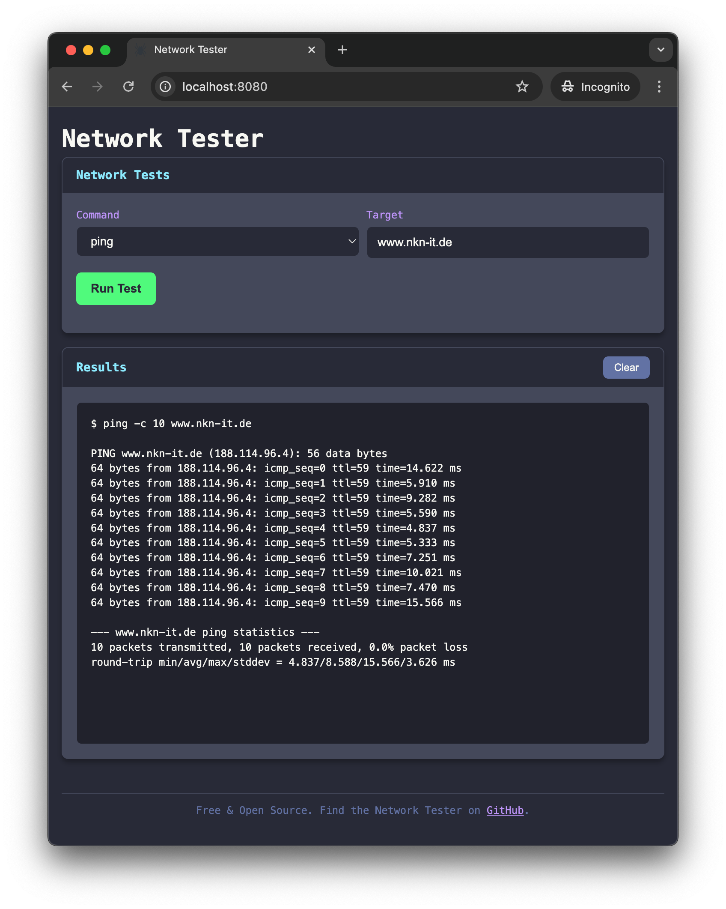

# Network Tester

A lightweight, cloud-native network diagnostic tool with a clean web interface.



**Container image:**

```text
docker.io/cyclenerd/network-tester:latest
```

**Multiarch support:**

* `amd64` : Intel or AMD 64-Bit CPU (x86-64)
* `arm64` : Arm-based 64-Bit CPU (i.e. Apple silicon, AWS Graviton, Ampere Altra, Google Axion)

## Quick Start

```bash
# Pull and run the container
docker run --privileged -p 8080:8080 "docker.io/cyclenerd/network-tester:latest"

# Access in browser
# http://localhost:8080
```

## Features

- **Real-time Command Output**: Watch network command results as they happen
- **Multiple Network Tools**: Run `ping`, `curl`, `dig`, `traceroute`, and `iperf3` from a single interface
- **Network Configuration Display**: View all network interfaces and their IP addresses
- **Cloud-Native Design**: Containerized for easy deployment in any environment

## Commands Supported

- **curl**: Test HTTP(s) data transfer
- **dig**: Perform DNS lookups with support for different record types (`A`, `AAAA`, `MX`, `NS`, `TXT`, etc.)
- **iperf3**: Measure network performance between hosts
- **nmap**: Network exploration and security auditing
- **nslookup**: Query Internet domain name servers
- **ping**: Test basic connectivity to hosts
- **traceroute**: Trace network path to target hosts

## Building from Source

```bash
# Clone the repository
git clone https://github.com/Cyclenerd/network-tester.git
cd network-tester

# Build the Container image
docker build --tag network-tester:test .

# Run the Container
docker run --privileged -p 8080:8080 network-tester:test
```

## Usage

1. Open your browser and navigate to `http://localhost:8080`
2. Select a command from the dropdown menu
3. Enter the target hostname or IP address
4. Configure any additional options if needed
5. Click "Run Test" to execute the command
6. View the results in real-time in the output panel

## Security Considerations

This tool executes network commands on the host system. When deploying in production:

- Run the container with appropriate security constraints
- Limit access to trusted users only
- Consider network policies to restrict where the container can send traffic

## Acknowledgments

- Built with [Go](https://go.dev/)
- UI styled with [Bootstrap](https://getbootstrap.com/) in dark mode
- Uses [Gorilla WebSocket](https://github.com/gorilla/websocket) for real-time communication

## License

All files in this repository are under the [Apache License, Version 2.0](LICENSE) unless noted otherwise.

The favicon was generated using the following graphics from Twitter Twemoji:

- Title: `1f577.svg`
- Author: Copyright 2020 Twitter, Inc and other contributors (<https://github.com/twitter/twemoji>)
- Source: <https://github.com/twitter/twemoji/blob/master/assets/svg/1f577.svg>
- License: [CC-BY 4.0](https://creativecommons.org/licenses/by/4.0/)
